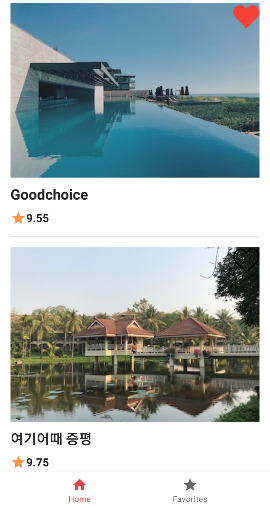
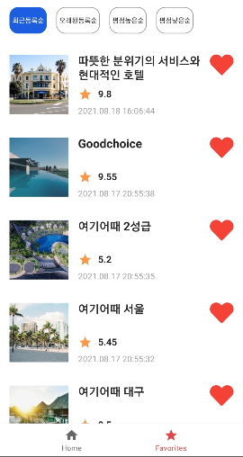
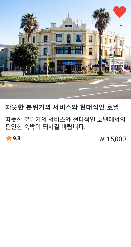

# MyRooms

  
  

  

> 네트워크 통신으로 받은 정보를 리스트로 보여주고 상세 페이지와 로컬데이터베이스를 이용해 즐겨찾기 기능 구현.

  

## Previews

## Paging3 Architecture

## Tech stack & Open-source libraries
- Minimum SDK level 23
- [Kotlin](https://kotlinlang.org/) based, [Coroutines](https://github.com/Kotlin/kotlinx.coroutines) + [Flow](https://kotlin.github.io/kotlinx.coroutines/kotlinx-coroutines-core/kotlinx.coroutines.flow/) for asynchronous.
- [Hilt](https://dagger.dev/hilt/) for dependency injection.
- JetPack
  - Lifecycle - dispose of observing data when lifecycle state changes.
  - ViewModel - UI related data holder, lifecycle aware.
  - Room - local database.
  - Paging3 - helps you load and display pages of data.
  - ViewPager2 - swipe views.

- Libraries
  - [Retrofit2 & OkHttp3](https://github.com/square/retrofit) - construct the REST APIs and paging network data.
  - [Moshi](https://github.com/square/moshi/) - A modern JSON library for Kotlin and Java.
  - [Glide](https://github.com/bumptech/glide) - loading images.
